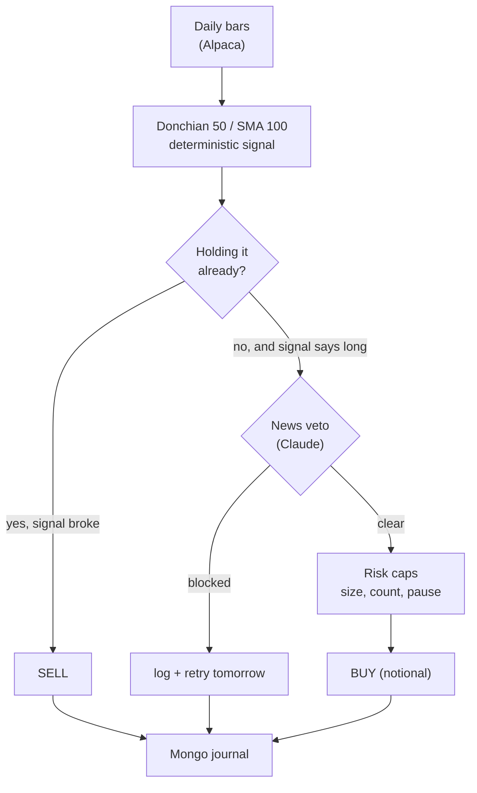
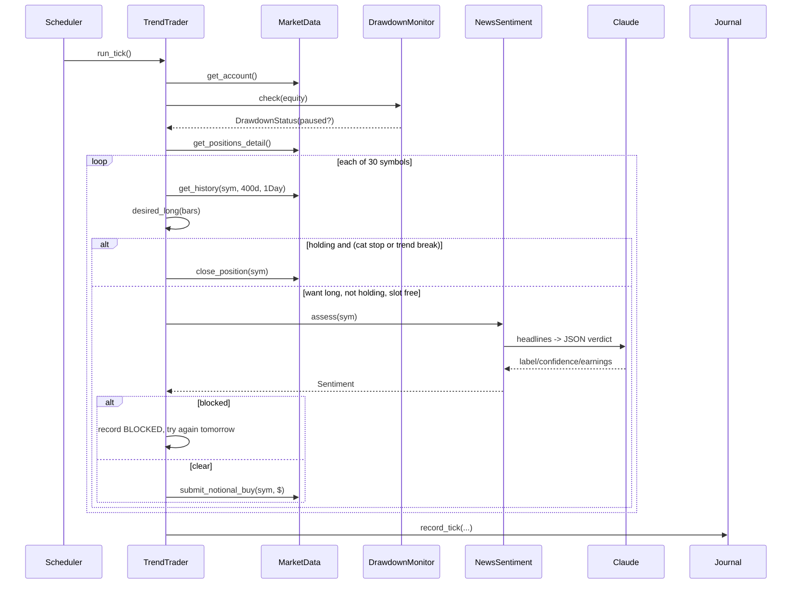

# 10X Trader — Architecture & Code Walkthrough

A step-by-step tour of what this system actually is, how a decision travels
through it, and why each layer exists. Written to be read top to bottom once,
then used as a reference.

> **Paper trading only.** No real capital. Nothing here is financial advice.

---

## How to read this document

| Part | What it covers | Read it when |
|---|---|---|
| [0. The 60-second version](#part-0--the-60-second-version) | What this is, in one page | Now |
| [1. The three principles](#part-1--the-three-principles) | The mental model everything follows from | Now |
| [2. Map of the codebase](#part-2--map-of-the-codebase) | Which file does what | Now |
| [3. Boot sequence](#part-3--boot-how-the-process-wires-itself) | `main.py`, dependency wiring | Before changing startup |
| [4. One tick, step by step](#part-4--one-tick-of-the-live-engine) | The live decision loop | **The core chapter** |
| [5. The strategy](#part-5--the-strategy-donchian--regime-filter) | Donchian breakout + regime filter | Before tuning params |
| [6. The indicator layer](#part-6--the-indicator-layer) | Deterministic math, no LLM | Before adding a signal |
| [7. The news veto](#part-7--the-news-veto-end-to-end) | Where Claude is used, and how it's fenced in | Before touching the prompt |
| [8. Risk, in three layers](#part-8--risk-in-three-independent-layers) | What stops a bad decision | Before loosening a limit |
| [9. The backtester](#part-9--the-backtester) | How an edge gets measured | Before believing any number |
| [10. The eval harness](#part-10--the-eval-harness) | How the *LLM* gets measured | The subtlest code here |
| [11. Config & profiles](#part-11--config--profiles) | YAML, env, two agents | When adding a symbol |
| [12. Deployment](#part-12--deployment) | Docker, auth, observation | When running it |
| [13. The dormant LLM path](#part-13--the-dormant-llm-path) | What v1 was, why it's off | Historical context |
| [14. What the numbers say](#part-14--what-the-numbers-actually-say) | Every measured result | Before proposing a change |
| [15. Known gaps](#part-15--known-gaps) | Where the honest holes are | Before trusting it |

Appendices: [commands](#appendix-a--command-reference) · [glossary](#appendix-b--glossary) · [file-by-file](#appendix-c--file-by-file-reference)

---

## Part 0 — The 60-second version

This is an autonomous paper-trading agent on Alpaca. It began as an LLM-driven
intraday day-trading bot, got measured, and became something quite different:

- **The trade decision is deterministic code.** A daily Donchian breakout with a
  moving-average regime filter. No model in the loop.
- **Claude is used in exactly one place:** reading recent headlines before an
  entry and deciding whether to *block* it. It can never open a position.
- **Risk limits live in code**, in a layer no model output can reach.
- **Two offline harnesses** exist to measure things before they go live: a
  backtester for the strategy, and an eval harness for the LLM filter.

The pivot happened because the original strategy was measured and found to lose
money. That measurement, and the machinery built to make it, is the actual value
of this project. See [Part 14](#part-14--what-the-numbers-actually-say).



---

## Part 1 — The three principles

Everything in the codebase follows from three rules. Learn these and the rest of
the design stops looking arbitrary.

### 1. Never trade an unvalidated edge

The decision logic must be expressible as code, replayable over history, and
measured with modelled costs *before* it touches an account. This is why
`src/trader/backtest/` exists and why it is not an afterthought.

The corollary is harsh and was applied: the original mean-reversion strategy was
backtested, came back with negative expectancy, and was deleted from the live
path the same day.

### 2. The LLM goes only where it has genuine edge — and only as a veto

Language models are bad at arithmetic over price series and good at synthesising
prose. So:

- Indicators are computed in pandas, never by the model (`indicators.py:1-11`).
- Claude reads *headlines*, which is a language task.
- Claude's output can only **subtract** — block an entry the deterministic signal
  wanted. It can never add one.

That asymmetry is not stylistic. It sets the entire evaluation metric, because a
component that can only block has only one way to hurt you. See
[Part 10](#part-10--the-eval-harness).

### 3. Risk is enforced in code, below the decision layer

Position caps, open-position counts, the whitelist and the daily drawdown
kill-switch are read from YAML at startup and enforced by plain Python. In the
legacy LLM mode they were enforced by a `PreToolUse` hook the model literally
could not reach around (`risk/hook.py`). No model output has ever been able to
raise a limit.

---

## Part 2 — Map of the codebase

```
src/trader/
├── main.py              entrypoint: wire dependencies, pick engine, run
├── scheduler.py          interval ticks, market-hours gating
├── config.py             env (pydantic-settings) + YAML config models
│
├── trend_trader.py      ★ THE LIVE ENGINE — deterministic daily executor
├── news.py              ★ the only LLM component — headline veto
├── indicators.py         deterministic TA math (RSI/BB/EMA/MACD/VWAP/Donchian)
├── market_data.py        alpaca-py wrapper: bars, account, orders, liquidation
│
├── risk/
│   ├── drawdown.py       daily kill-switch (Redis-backed, latching)
│   └── hook.py           PreToolUse order gate (legacy LLM mode only)
│
├── backtest/
│   ├── trend.py         ★ desired_long() + backtest_trend() — live & sim share this
│   ├── engine.py         mean-reversion simulator (legacy strategy)
│   ├── signals.py        the legacy rules, as code
│   ├── metrics.py        expectancy, PF, Sharpe, max drawdown
│   └── run.py            CLI: python -m trader.backtest.run
│
├── eval/
│   ├── news_replay.py   ★ counterfactual A/B of the news filter
│   ├── cache.py          on-disk verdict cache, keyed by prompt+model
│   └── run.py            CLI: python -m trader.eval.run
│
├── persistence/
│   ├── journal.py        Mongo: one document per tick
│   └── cache.py          Redis: snapshots, drawdown anchor, news TTL
│
├── agent.py              legacy LLM ReAct engine (dormant)
├── prompt.py             legacy system prompt builder
└── mcp_client.py         legacy Alpaca MCP wiring + hook registration
```

The four starred files are where the system actually lives. Everything else is
plumbing or history.

---

## Part 3 — Boot: how the process wires itself

`main.py:34-68`. Read it once; it is the whole dependency graph in 35 lines.

**Step 1 — load config.** `load_config()` (`config.py:185`) is
`@lru_cache`'d, so config is read once per process. It merges two sources:

- **Environment / `.env`** via pydantic-settings (`config.py:17-62`) — secrets
  and infra: Alpaca keys, Mongo URI, Redis URL, model name, and the two
  variables that define an agent's identity: `TRADER_AGENT_NAME` and
  `TRADER_CONFIG_DIR`.
- **Three YAML files** from `TRADER_CONFIG_DIR` — `watchlist.yaml`, `risk.yaml`,
  `strategy.yaml`. These are volume-mounted in Docker, so tuning is a restart,
  not a rebuild.

**Step 2 — build the clients.** `MarketData(cfg)` (`market_data.py:48`)
constructs three alpaca-py clients: a stock historical client, a crypto
historical client, and a `TradingClient` pinned to paper.

**Step 3 — health-check the stores.** `_check_health` pings Redis and Mongo and
lets the process die loudly if either is unreachable. Better a crash at boot
than a silent journal failure at 09:31.

**Step 4 — scope the kill-switch.** This is a subtle and important line:

```python
own_symbols = list(cfg.watchlist.whitelist)
drawdown = DrawdownMonitor(
    cfg.risk, cache, liquidate_fn=lambda: market.close_positions(own_symbols)
)
```

Two agents share one Alpaca account. If the equity agent trips its drawdown
limit it must liquidate *only its own symbols* — never the crypto agent's book.
The scoping is injected here as a closure, so `DrawdownMonitor` itself knows
nothing about profiles.

**Step 5 — choose the engine.** `cfg.strategy.mode` selects between
`TrendTrader` (deterministic, current) and `TradingAgent` (LLM ReAct, dormant).
Note that `mcp_client` is imported *inside* the `else` branch's module, so in
trend mode the MCP dependency is never even loaded.

**Step 6 — prove the wiring.** The account equity is logged before anything
trades. A cheap, real end-to-end assertion that credentials work.

**Step 7 — run.** Either one tick (`TRADER_RUN_ONCE=true`, used by the Docker
healthcheck path and manual testing) or `TickScheduler.start()`.

### The scheduler, and a bug worth knowing

`scheduler.py:54-82`. Three details earn their comments:

```python
scheduler.add_job(
    self._tick,
    IntervalTrigger(minutes=...),
    max_instances=1,   # never overlap ticks
    coalesce=True,      # collapse missed runs into one
)
```

- `max_instances=1` plus the `self._running` flag in `_tick` means a slow tick
  can never overlap with the next one. Two concurrent ticks would double-order.
- `coalesce=True` means a machine that was asleep for an hour runs *one* catch-up
  tick, not twelve.
- **The commented-out footgun:** passing `next_run_time=None` to `add_job` adds
  the job *paused*, and the interval silently never fires. This shipped once —
  agents only ticked on boot/restart for a full day before it was caught. There
  is still no automated assertion that the interval actually fired; see
  [Part 15](#part-15--known-gaps).

`_should_run()` (`scheduler.py:32-39`) gates on market hours — except if the
watchlist holds any crypto symbol, in which case it always runs, because crypto
trades 24/7. A failed clock check skips the tick rather than assuming open.

---

## Part 4 — One tick of the live engine

This is the chapter to understand. `TrendTrader.run_tick()`,
`trend_trader.py:36-141`. It is one function, deliberately, and it reads top to
bottom.



### Step 1 — account and drawdown, before anything else

```python
acct = self._market.get_account()
dd = self._drawdown.check(acct.equity)
positions = self._market.get_positions_detail()
open_syms = [s for s in positions if s in whitelist]
```

`DrawdownMonitor.check()` (`drawdown.py:41-67`) does four things:

1. Reads today's **anchor** from Redis, keyed by UTC date. If absent, *this
   equity becomes the anchor* and is written with a 36-hour TTL.
2. Computes `drawdown = (anchor - equity) / anchor`.
3. If the limit is breached **and not already paused**, it calls the injected
   `liquidate_fn` and latches a `paused` flag in Redis for the day.
4. Returns a `DrawdownStatus`.

The latch matters: liquidation fires **once**, not on every subsequent tick.
And note `open_syms` is filtered by whitelist — positions from another agent or
opened by hand are visible but never counted against this agent's slots.

> **Live footgun:** the anchor is the first equity *observed* today. Change the
> account balance mid-session and the anchor is stale, so the next tick reads a
> false 30% drawdown and liquidates. The fix is manual: delete
> `trader:<agent>:anchor:*` and `:paused:*` in Redis, then restart.

### Step 2 — per-symbol loop

For each of the 30 symbols:

```python
bars = self._market.get_history(symcfg, tp.history_days, timeframe="1Day")
if len(bars) < tp.trend_ma + 2:
    continue
want_long = desired_long(bars, ...) and not dd.paused
holding = sym in positions
```

Three things to notice:

- **400 days of daily bars** are pulled per symbol per tick. That is the
  `history_days` param, and it exists because a 100-day SMA plus a 50-day
  channel needs real runway.
- A history fetch failure `continue`s past that one symbol. One bad symbol never
  kills a tick.
- **`and not dd.paused`** is where the kill-switch actually bites: when paused,
  `want_long` is false for every symbol, so no entry can be proposed. Exits are
  unaffected — you can always get *out*.

### Step 3 — reconcile, don't re-decide

The loop body is a reconciliation between two booleans, `want_long` and
`holding`. That is the whole design:

| `holding` | `want_long` | Action |
|---|---|---|
| yes | — | **SELL** if price ≤ entry × (1 − 20%) → `cat_stop` |
| yes | no | **SELL** → `trend_break` |
| yes | yes | hold (no action, no order) |
| no | yes | **BUY** — subject to slot count, news veto, cash |
| no | no | nothing |

The catastrophic stop is checked *first* and overrides. In practice the channel
exit almost always fires before a 20% loss, which is why the `cat_stop_pct`
default is deliberately wide — it is a backstop against a gap, not a strategy.

Because this is a reconciliation and not an event handler, the engine is
**idempotent in state**: if a tick crashes halfway, the next tick recomputes
from scratch and converges. There is no "pending order" state machine to corrupt.

### Step 4 — the news veto, on entries only

```python
elif want_long and len(open_syms) < cfg.risk.max_open_positions:
    blocked = False
    if self._news is not None:
        sent = await self._news.assess(sym)
        blocked, reason = self._news.should_block(sent)
        news_log.append({... "headlines": sent.headlines,
                         "model": sent.model,
                         "prompt_version": sent.prompt_version, ...})
```

Three deliberate choices:

1. **Only breakout candidates get scored.** Not every symbol, not every tick.
   That is why LLM cost is negligible — the veto is consulted a few times a week,
   not 30 times an hour.
2. **The slot check comes before the LLM call.** No point paying for a verdict on
   a trade you have no room for.
3. **The headlines, model, and prompt version are journaled alongside the
   verdict.** This is what makes production decisions re-scorable against a
   future prompt. Without the input, a stored verdict is a dead end.

### Step 5 — sizing, and the cash trap

```python
target = round(cfg.risk.max_position_pct * acct.equity, 2)
notional = min(target, round(acct.cash * 0.98, 2))
if notional < 20:
    actions.append({"action": "SKIP", ...})
else:
    oid = self._market.submit_notional_buy(sym, notional)
```

Target size is 10% of **equity**, but you can only spend **cash**. The `min()`
and the 2% buffer exist because a market notional order can fill slightly above
the quote, and without the buffer the final position of the day bounces on
"insufficient buying power". Sub-$20 entries are skipped as dust.

`submit_notional_buy` (`market_data.py:149-160`) places a market buy for a
dollar amount with `TimeInForce.DAY` — required for fractional equity orders.

### Step 6 — journal everything

```python
doc_id = self._journal.record_tick(agent=..., snapshot=states, account=...,
    reasoning=..., tool_calls=actions, order_ids=..., news=news_log, error=None)
```

One Mongo document per tick (`journal.py:23-56`). `actions` carries every
`BUY` / `SELL` / `BLOCKED` / `SKIP` / `ERROR`, and `states` carries the
`want_long` / `holding` / `price` triple for all 30 symbols — so you can
reconstruct *why nothing happened* on a quiet day, which is most days.

---

## Part 5 — The strategy: Donchian + regime filter

`backtest/trend.py`. Classic Turtle-style trend following, long-only, on daily
bars.

| Rule | Param | Default |
|---|---|---|
| Enter when close > prior N-day high | `entry_channel` | 50 |
| Only while close > M-day SMA | `trend_ma` + `use_regime_filter` | 100, on |
| Exit when close < prior K-day low | `exit_channel` | 20 |
| Catastrophic stop | `cat_stop_pct` | 20% |
| Take profit | — | **none, by design** |

The absence of a take-profit is the strategy. Trend following makes its money
from a small number of very large winners; capping them destroys the edge. The
measured shape confirms it: 55% win rate, but `avg_win` +15.8% against
`avg_loss` −7.2%.

### `desired_long()` — a state read, not an event

`trend.py:21-54`. This function is the hinge between live and backtest, and its
design is the cleverest thing in the codebase:

```python
entries = close > prior_high
exits   = close < prior_low
last_entry = entries[entries].index.max()
last_exit  = exits[exits].index.max()
in_trend = last_exit is None or last_entry > last_exit
```

It does not ask "did a breakout happen *today*". It asks "**is the most recent
breakout more recent than the most recent breakdown**" — a read of current trend
*state*. Two consequences:

- **The live engine needs no memory.** It can be restarted, redeployed, or run
  on a fresh container and it recomputes the same answer. No position state to
  persist, no missed-event risk.
- **A news veto degrades gracefully.** Because the answer is a state, a block
  today simply means the engine asks again tomorrow, and the leg is still there.
  A veto **delays** an entry rather than cancelling it. This single property is
  what makes the eval's cost accounting honest — see [Part 10](#part-10--the-eval-harness).

### `backtest_trend()` — the same rules, simulated

`trend.py:56-144`. The simulator's discipline:

- **No lookahead.** A decision made at bar `i`'s close executes at bar `i+1`'s
  open. The `pending` variable carries the decision across the boundary.
- **Slippage on both sides.** Entry at `open * (1 + slip)`, exit at
  `open * (1 - slip)`. Default 5 bps/side, so 10 bps round-turn.
- **Intrabar stop check** against the bar's `low`, not its close.
- **Prior-window channels are `.shift(1)`'d** so the current bar can never be
  part of the range it is trying to break.
- **Open positions are marked to market** at the final bar with reason `eod`, so
  a runaway winner still in flight is counted honestly rather than dropped.

The `veto` parameter and the `deferred` flag exist purely for the eval harness.
With `veto=None` the retry branch is unreachable and the simulation is
bit-identical to the unfiltered one — *that identity is what makes the A/B fair*.

---

## Part 6 — The indicator layer

`indicators.py`. Pure functions over a pandas DataFrame, no I/O, no network,
fully unit-tested. The module docstring states the reason plainly: LLMs are
unreliable at arithmetic over raw OHLCV, so the numbers are computed here and
only the results are handed to a model.

`compute_snapshot()` (`indicators.py:69-151`) returns a flat dict of about 25
numeric fields: Wilder RSI, Bollinger bands plus a normalised `bb_pct`, fast/slow
EMA plus an `ema_trend` label, MACD line/signal/histogram, session VWAP plus an
`above`/`below` label, volume ratio plus a `volume_surge` boolean, and Donchian
channel high/low with `breaking_high` / `breaking_low` flags.

Two details worth copying elsewhere:

- **It raises `ValueError` rather than returning garbage** when there are too few
  bars for the longest window (`required = max(...)`). Callers treat that as
  "skip this symbol", which is the right failure.
- **Labels accompany numbers.** `ema_trend: "up"` alongside the raw EMAs. When
  these were fed to a model, the label removed a comparison the model could get
  wrong.

Note that the current trend engine does **not** use `compute_snapshot` — it goes
straight to `desired_long`. The indicator module is live-loaded by the legacy
path and the mean-reversion backtester only.

---

## Part 7 — The news veto, end to end

`news.py`. The only LLM component in the running system, and it is fenced in
four ways.

### The prompt contract

`news.py:21-31`:

```
You are a terse financial news analyst. Given recent headlines for one ticker,
judge the near-term (days) directional risk for a LONG position. Respond with
ONLY a JSON object, no prose:
{"label":"bullish|neutral|bearish","confidence":0.0-1.0,
 "earnings_imminent":true|false,"rationale":"<=20 words"}
earnings_imminent = the company reports earnings within ~3 trading days.
```

Short, structured, single-purpose. `max_turns=1`, so no tool use and no
multi-step reasoning loop (`news.py:85`).

### `PROMPT_VERSION`

`news.py:33`. A string bumped by hand whenever `_SYSTEM` changes. It is recorded
on every `Sentiment` and forms part of the eval cache key. Without it you
cannot distinguish a prompt regression from a market regime change — which is
the entire reason the eval harness can act as a regression test.

### The pipeline

1. **Fetch** — `fetch_window(symbol, start, end)` (`news.py:115-137`) pulls
   headlines from Alpaca's Benzinga-backed news API. The optional `end` bound is
   the no-lookahead guarantee that offline replay depends on. It is
   version-robust across alpaca-py 0.43's move from `res.news` to
   `res.data['news']`.
2. **Score** — `claude_score()` (`news.py:76-94`) is deliberately
   module-level, not a method, so the eval harness can call it without building
   a `NewsSentiment` (which would need a live Redis and Alpaca client).
3. **Parse** — `parse_sentiment()` (`news.py:55-73`) finds the outermost
   `{...}` in the reply, so code fences and stray prose do not break it. An
   unrecognised label collapses to `neutral`; any exception returns
   `Sentiment(error=...)`.
4. **Cache** — verdicts go to Redis per symbol with a 120-minute TTL
   (`persistence/cache.py:57-58`).
5. **Decide** — `should_block()` (`news.py:172-181`).

### `should_block` — read this function carefully

```python
if sent.error:
    return False, f"news error (fail-open): {sent.error}"
if p.block_on_imminent_earnings and sent.earnings_imminent:
    return True, "earnings imminent (gap risk)"
if p.block_on_bearish and sent.is_bearish and sent.confidence >= p.bearish_confidence_min:
    return True, f"bearish news (conf {sent.confidence:.2f}): {sent.rationale}"
return False, sent.label
```

**Fail-open is the first branch.** Every error path — network failure, bad JSON,
model timeout — returns "do not block". The validated deterministic edge stays in
charge when the unvalidated component is broken.

This is not a rare path. In the 1500-day eval, **111 of 271 consultations
errored** (41%) and all of them failed open. Read that as: the system spent most
of that run trading its deterministic strategy unfiltered, exactly as intended.

Note also that `label: "bullish"` reaches `return False, sent.label` — a bullish
verdict is indistinguishable in effect from a neutral one. The model has no
mechanism to make a trade *more* likely. That is the "block, never initiate"
constraint, enforced by control flow rather than by instruction.

---

## Part 8 — Risk, in three independent layers

### Layer 1 — config caps, checked inline

`risk.yaml`, loaded into `RiskConfig` (`config.py:83-91`), enforced in
`trend_trader.py`:

| Setting | Current | Enforced where |
|---|---|---|
| `max_position_pct` | 0.10 | sizing arithmetic |
| `max_open_positions` | 10 | `len(open_syms) <` guard |
| `daily_drawdown_pct` | 0.10 | `DrawdownMonitor` |
| `long_only` | true | no short path exists in `TrendTrader` |
| `require_stop_loss` | **false** | see below |

`require_stop_loss: false` deserves its comment. Fractional (notional) equity
orders **cannot carry Alpaca bracket orders**. On a ~$1,000 account every
position is fractional, so there is no resting stop at the broker. Exits are
managed by the engine on ticks, which means **overnight and gap risk is real and
unhedged**.

### Layer 2 — the drawdown kill-switch

`risk/drawdown.py`. Covered in [Part 4](#step-1--account-and-drawdown-before-anything-else). The
properties that matter: date-keyed in Redis, latching (liquidates once), scoped
to one agent's symbols, and blocking entries while permitting exits.

### Layer 3 — the `PreToolUse` gate (legacy path only)

`risk/hook.py`. This is the most interesting risk code in the repo even though
it is currently dormant, because it solves a problem that recurs in any
agentic system: **how do you stop a model from taking an action you did not
sanction?**

The answer: register a hook that intercepts the tool call *before* it reaches
the server.

```python
hooks={"PreToolUse": [
    HookMatcher(matcher="mcp__alpaca__place_.*", hooks=[risk_hook]),
    HookMatcher(matcher="mcp__alpaca__close_.*", hooks=[risk_hook]),
]}
```

`evaluate_order()` (`hook.py:97-178`) is a **pure function** — no SDK types, no
I/O — so it is directly unit-testable, and `test_risk_hook.py` has 14 tests
against it. Its checks, in order:

1. `close_*` / `cancel_all_orders` → **always allow** (risk-reducing).
2. Paused by drawdown → deny.
3. `long_only` and side is sell → deny.
4. Missing symbol → deny.
5. Not in whitelist → deny.
6. `require_stop_loss` and no stop found → deny.
7. Stop distance > `max_stop_distance_pct` → deny.
8. Would exceed `max_open_positions` → deny.
9. Notional undeterminable → deny.
10. Notional > `max_position_pct × equity` → deny.

Every decision is recorded via the `on_decision` callback and journaled, so a
denial is visible after the fact with its reason.

`_extract_stop_loss()` (`hook.py:64-84`) is scar tissue. The first version only
knew the nested `stop_loss` shape, but the real alpaca-mcp `place_stock_order`
uses flat keys (`stop_loss_stop_price`). Result: the hook denied **every**
bracket order, and would have blocked every trade forever. It was caught by the
first real order and now has a regression test. The lesson is general: a
fail-closed gate that misreads its input fails *silently and totally*.

> **Known gap in this layer:** `cancel_all_orders` is in `allowed_tools` but
> matches neither `place_.*` nor `close_.*`, so the hook never sees it and it
> never lands in `risk_decisions`. Benign today, since `evaluate_order` would
> allow it anyway — but the code reads as though it is gated, and it is not.

---

## Part 9 — The backtester

`backtest/run.py` is the CLI; `engine.py` and `trend.py` are the two simulators.

```bash
# the live strategy, ~4 years
PYTHONPATH=src TRADER_CONFIG_DIR=config/equity \
  python -m trader.backtest.run --mode trend --days 1500

# the legacy strategy, for comparison
PYTHONPATH=src TRADER_CONFIG_DIR=config/equity \
  python -m trader.backtest.run --mode meanrev --days 60
```

### The five disciplines

1. **No lookahead** — signal at close, execute at next open, in both simulators.
2. **Modelled costs** — 5 bps/side slippage by default, commission zero for
   Alpaca. `engine.py:45` computes a round-turn `cost = 2 * slippage_pct` and
   subtracts it from every trade's gross return.
3. **Split/dividend adjustment** — `get_history()` passes
   `adjustment=Adjustment.ALL` (`market_data.py:105-113`). Without it, a split
   appears as a price crash; an unadjusted NVDA showed a fake −78% and corrupted
   a whole run before this was found.
4. **Warmup** — both simulators compute the longest indicator window and refuse
   to trade before it (`engine.py:46-56`, `trend.py:79`).
5. **Compare against buy-and-hold** — printed per symbol and for the portfolio.
   A strategy that underperforms holding SPY has not found an edge.

### The metrics

`metrics.py:38-76`. Worth understanding what each number means here:

- **expectancy** — mean net return per trade. The single most important number;
  if it is negative, nothing else matters.
- **profit factor** — gross wins ÷ gross losses. Above 1 means profitable; ~2.7
  here.
- **total_return** — compounded at `position_fraction` sizing, in trade order.
- **max_drawdown** — peak-to-trough on that same compounded curve.
- **sharpe** — per-trade mean/std, annualised by the *observed* trade frequency
  (`_annualization`, `metrics.py:27-36`). This is a per-trade Sharpe, not a
  daily-returns Sharpe, so it is not directly comparable to published figures.

The runner prints a blunt verdict line: positive expectancy after costs, or
"NO edge". That output is what killed the original strategy.

---

## Part 10 — The eval harness

`eval/news_replay.py`. The subtlest code in the repo, and the part most worth
studying, because it answers a question most LLM systems never ask: **is the
model component actually earning its keep?**

### The question, framed correctly

The filter can only block. So:

- A **false positive** kills a trade drawn from a +5.5%-expectancy distribution.
  That costs real money.
- A **false negative** merely returns you to the unfiltered baseline. That costs
  nothing.

Accuracy is therefore the wrong metric. The right one is **block precision** —
of the blocks we can price, what share landed on a trade that would have lost?
And the bar is not 50%: blocking at *random* scores the baseline loss rate. The
strategy wins 55.3% of its trades, so random blocking lands on a loser 44.7% of
the time, and the filter must beat that. The bar moves with the win rate, so the
harness computes it per run rather than hard-coding it.

### The method: two arms, one simulator

```python
# arm A — baseline
backtest_trend(sym, bars, ..., veto=None)
# arm B — filtered
backtest_trend(sym, bars, ..., veto=_LazyVeto(...))
```

Identical history, identical code path. The only difference is the veto
callable. That is why the comparison is honest.

### No-lookahead, precisely

`session_close_utc()` (`news_replay.py:50-56`) maps a daily bar to the moment
its close was observed (21:00 UTC, conservative through DST). Headlines are
windowed to `[close - lookback, close)`. Nothing published after the decision can
reach the model. The `veto` callback is documented as being invoked at the
decision bar's close for exactly this reason (`trend.py:56-75`).

### The concurrency problem, and its solution

`backtest_trend` is a tight synchronous loop. Scoring is async and
network-bound. `_LazyVeto` (`news_replay.py:225-262`) bridges them:

- each symbol's simulation runs in a worker thread;
- each veto call hands its scoring request back to the event loop via
  `asyncio.run_coroutine_threadsafe` and blocks on the future;
- `_Scorer` (`news_replay.py:156`) dedupes by an in-flight task table, so the
  same `(symbol, day)` is scored at most once no matter how many callers ask.

There is a deadlock lurking here that the code documents and avoids: the
simulations get their **own** `ThreadPoolExecutor` rather than sharing
`asyncio.to_thread`'s default pool. Share one pool and every worker eventually
becomes a simulation blocked on a headline fetch that cannot get a thread.

The payoff of laziness: only bars the simulation *actually reaches* are scored.
The `--plan` mode's `block=True` probe shows the pathological upper bound, and it
is an order of magnitude more calls.

### Attribution — the part everyone gets wrong

`_attribute()` (`news_replay.py:270-321`) does three things:

1. **Marks window starts.** A block on Monday is followed by retries Tuesday,
   Wednesday… as long as the trend leg lives. One *opportunity* was blocked, not
   four. `first_of_window` distinguishes them, and reporting counts windows.
2. **Prices the block.** A decision at bar `i` executes at bar `i+1`, so a veto
   maps to the baseline trade whose `entry_time` is the next bar.
3. **Checks re-entry.** Did the filtered arm get into that leg anyway, later?

Point 3 is the crucial one, and it follows directly from `desired_long` being a
state read. **The sum of blocked trades' returns is not the cost of the filter.**
A veto usually delays an entry by a few days and recaptures most of the move. The
only honest measure of cost is the **expectancy/return delta between the two
arms**. The report says so explicitly, and labels each block `re-entered later`
or `leg abandoned`.

### The cache is the regression test

`eval/cache.py`. The key is
`symbol|day|lookback|prompt_version|model`. Changing the prompt or the model
**invalidates every verdict by design** — that is the regression signal, not a
nuisance. Re-running after changing only the *report* costs nothing.

### Stated contamination

The harness's own docstring says it: the model has training knowledge of what
happened after these dates, which biases the filter toward looking good. The
report prints this caveat on every run. So:

- A **poor** result is a lower bound on how poor it really is.
- A **good** result is not proof of an edge.

Building a measurement and then publishing its own invalidity is the right
instinct, and it is rarer than it should be.

---

## Part 11 — Config & profiles

### Two agents, one image

Identity is two environment variables:

- `TRADER_AGENT_NAME` — namespaces Redis keys (`trader:<name>:...`) and tags
  every journal document.
- `TRADER_CONFIG_DIR` — selects `config/equity/` or `config/crypto/`.

Each profile holds three files:

**`watchlist.yaml`** — 30 diversified large-caps and ETFs for equity: four
broad-market/index ETFs, then tech, finance, healthcare, energy, industrials,
consumer. `whitelist` (`config.py:75-77`) is derived from it and is the only set
of tradeable symbols.

> Note: each entry still carries `bar_timeframe: 5Min` and `lookback_bars: 120`.
> Trend mode ignores both — it passes `timeframe="1Day"` explicitly. They are
> vestigial fields from the intraday era, live only in the legacy path.

**`risk.yaml`** — the limits in [Part 8](#part-8--risk-in-three-independent-layers).

**`strategy.yaml`** — `mode: trend`, `tick_interval_minutes: 60`, the `trend:`
block, the `news:` block, and below a divider, the legacy LLM-mode params kept
for the mean-reversion backtester.

### Environment

`.env`, never committed. `ALPACA_API_KEY` / `ALPACA_SECRET_KEY`, and
`CLAUDE_CODE_OAUTH_TOKEN` — this project authenticates Claude via a
**subscription OAuth token** from `claude setup-token`, not an API key. Compose
deliberately blanks `ANTHROPIC_API_KEY` so a stray key cannot override it.

---

## Part 12 — Deployment

`docker-compose.yml`. Five services, three of them profile-gated and off by
default:

| Service | State | Notes |
|---|---|---|
| `agent-equity` | **on** | the live agent |
| `redis`, `mongo` | **on** | state + journal |
| `agent-crypto` | `--profile crypto` | paused: Alpaca paper does not fill crypto |
| `alpaca-mcp` | `--profile llm` | only the dormant LLM mode needs it; also currently unbuildable upstream |
| `mongo-express` | `--profile ui` | weak basic-auth, loopback-bound; use an SSH tunnel |

`./config` is volume-mounted, so tuning is `docker compose restart`, not a
rebuild.

```bash
cp .env.example .env          # fill in keys + CLAUDE_CODE_OAUTH_TOKEN
docker compose up -d --build
```

**Observing it:**

```bash
docker compose logs -f agent-equity | grep "trend tick"
docker compose exec mongo mongosh trader \
  --eval 'db.ticks.find().sort({_id:-1}).limit(1)'
```

Host-specific gotchas, from the README: on colima, Compose's `buildx bake` hangs
and the `osxkeychain` credential helper is broken — build with
`DOCKER_BUILDKIT=1 docker build` and run compose with a `DOCKER_CONFIG` pointing
at a config copy with `credsStore` stripped.

### Tests

`pytest`, 67 test functions across 7 files:

| File | Tests | Covers |
|---|---|---|
| `test_eval_news_replay.py` | 19 | attribution, windowing, no-lookahead |
| `test_risk_hook.py` | 14 | every deny branch + the bracket-key regression |
| `test_news.py` | 11 | parsing, fail-open, `should_block` thresholds |
| `test_backtest.py` | 10 | no-lookahead, cost model, `desired_long` |
| `test_indicators.py` | 8 | golden values for each indicator |
| `test_drawdown.py` | 3 | anchor, latch, scoped liquidation |
| `test_cache.py` | 2 | namespacing, TTL |

No network, no Alpaca, no Redis, no Mongo — LLM and data calls are stubbed.
(I could not execute the suite while writing this: the system Python here has no
`pytest` installed. Run it in the project venv or container.)

---

## Part 13 — The dormant LLM path

Kept for reference and for the mean-reversion backtester. Understanding it
explains most of the architecture's shape.

`agent.py::run_tick()` was a full ReAct cycle over the whole watchlist:

1. Cancel own stale unfilled orders (`agent.py:115-125`).
2. `_gather()` — account + per-symbol indicator snapshots, computed in code.
3. `_enforce_software_stops()` — deterministic stop/target exits, **before** the
   model runs, so hard exits never depended on it.
4. Drawdown check.
5. Build `RiskContext` + the `PreToolUse` hook.
6. `build_options()` — model, system prompt, MCP server, `allowed_tools`, hooks.
7. `ClaudeSDKClient.query()` then stream `receive_response()`, dispatching on
   `type(block).__name__`: `TextBlock` → reasoning, `ToolUseBlock` → tool calls,
   `ToolResultBlock` → results plus an order-id regex.
8. Journal everything, including denials.

Nine tools were exposed (`mcp_client.py:22-33`): four read-only data tools,
ungated; five order tools, of which `place_*` and `close_*` passed through the
risk hook.

Two structural lessons carried forward into the current design:

- **Indicators were always computed in code.** The model received numbers, never
  raw bars. That decision predates the pivot and survived it.
- **Hard exits ran outside the model.** Software stops and drawdown liquidation
  called `market.close_position()` directly, bypassing both the LLM and the hook.
  A model that hangs or returns nonsense could never prevent an exit.

It was retired because the strategy it was executing was measured and found to
lose money — not because the agent machinery failed. That distinction matters
when reading the changelog.

---

## Part 14 — What the numbers actually say

Every measured result in one table. Sources: `CHANGELOG.md`, `eval-news.json`.

| Approach | Result | Verdict |
|---|---|---|
| Intraday mean-reversion (RSI/Bollinger), LLM-driven | expectancy **−0.08%/trade**, PF ~0.45, **≈−50%** | Killed |
| Daily trend-following, 12 symbols | expectancy +7.7%/trade, PF ~3, Sharpe ~1.8 | Real edge |
| Daily trend-following, 30 symbols | PF **2.82**, Sharpe **2.41**, max DD 9%, 251 trades | Diversification improved risk-adjusted return |
| Small-account options | unbacktestable, ~6.5% spreads, negative base rate | Declined |
| News filter (1500d eval) | expectancy 5.499% → 5.530% | Roughly neutral |

The mean-reversion number deserves a second look. Net expectancy was −8 bps with
10 bps of modelled round-turn cost, so the **gross** edge was about +2 bps — a
rounding error against its own transaction costs. That is the clearest statement
of why the system moved to a multi-week holding period.

### The news filter, in detail

From `eval-news.json` (1500 days, 30 symbols, `claude-opus-4-8`, prompt v1):

| Metric | Baseline | Filtered |
|---|---|---|
| trades | 255 | 255 |
| win rate | 55.3% | 55.3% |
| expectancy/trade | 5.499% | 5.530% |
| profit factor | 2.705 | 2.728 |
| total return | 286.4% | 289.5% |
| max drawdown | 12.42% | 11.92% |
| Sharpe (ann) | 2.451 | 2.466 |

Activity: 271 entry decisions consulted, 11 entries blocked, 149 LLM calls,
**111 errors (41%, all failed open)**.

Attribution: 11 priceable blocks — 7 avoided losers, 4 killed winners. Block
precision **63.6%** against a 44.7% random baseline.

**How to read this honestly.** The delta is +0.03 percentage points of
expectancy. Precision beat its base rate, but at n=11, P(≥7 of 11 | p=0.447) ≈
0.17 — suggestive, nowhere near significant. And the whole measurement is biased
*in the filter's favour* by the model's hindsight. The defensible conclusion is
that the veto is approximately free, possibly slightly positive, and not yet
something to build on. It is not evidence of an edge.

That is a genuinely useful result. It cost a few hundred LLM calls to learn that
a component is not worth expanding — which is cheaper than discovering it with
capital.

---

## Part 15 — Known gaps

Stated plainly, because a design document that only lists strengths is marketing.

**Measurement**

- The trend edge was measured on **mega-cap survivors in a broadly bullish
  window**. Real validation needs out-of-sample data, a delisted-inclusive
  universe, and walk-forward testing.
- The eval's contamination is structural, not fixable by more compute. Only
  forward-looking measurement on unseen dates escapes it.
- Sharpe here is per-trade annualised, not a daily-returns Sharpe. Do not
  compare it to published fund figures.

**Live mechanics**

- **No resting stops.** Fractional positions cannot carry brackets, so exits
  depend on the engine ticking. Overnight and weekend gap risk is unhedged.
- **Stale drawdown anchor** after a mid-session balance change causes a false
  kill-switch, and the recovery is manual Redis surgery.
- **No liveness assertion** that the interval actually fired. The
  `next_run_time=None` bug class would not be caught automatically today.
- **`TrendTrader` does not cancel stale orders.** `agent.py` does
  (`agent.py:115-125`); the trend path never got the same reconciliation.
- **No startup reconciliation** of broker positions against local expectations.
- **`cancel_all_orders` bypasses the risk hook matchers** (legacy path).

**Structural**

- Single process, single account. No horizontal story, and none needed.
- `mongo-express` basic-auth is weak; it is profile-gated and loopback-bound for
  that reason.
- The `alpaca-mcp` service is currently unbuildable from upstream `main`.
- Beating buy-and-hold consistently is hard. The realistic win is *similar return
  at materially lower drawdown and exposure*, plus the framework to keep testing.

---

## Appendix A — Command reference

```bash
# --- run ---
docker compose up -d --build
docker compose --profile crypto up -d agent-crypto     # paused agent
docker compose --profile ui up -d mongo-express        # journal UI (tunnel it)
docker compose logs -f agent-equity | grep "trend tick"

# --- one-shot tick (no scheduler) ---
TRADER_RUN_ONCE=true PYTHONPATH=src TRADER_CONFIG_DIR=config/equity trader

# --- backtest ---
PYTHONPATH=src TRADER_CONFIG_DIR=config/equity \
  python -m trader.backtest.run --mode trend --days 1500
PYTHONPATH=src TRADER_CONFIG_DIR=config/equity \
  python -m trader.backtest.run --mode meanrev --days 60
#   flags: --slippage-bps --entry-channel --exit-channel --trend-ma

# --- eval the news filter ---
PYTHONPATH=src TRADER_CONFIG_DIR=config/equity \
  python -m trader.eval.run --days 1500 --plan          # free: count the cost
PYTHONPATH=src TRADER_CONFIG_DIR=config/equity \
  python -m trader.eval.run --days 1500 --out eval-news.json
#   flags: --symbols --concurrency --cache --close-utc-hour

# --- tests ---
pip install -e ".[dev]" && pytest

# --- inspect the journal ---
docker compose exec mongo mongosh trader \
  --eval 'db.ticks.find().sort({_id:-1}).limit(1)'

# --- clear a stale drawdown anchor ---
docker compose exec redis redis-cli --scan --pattern 'trader:equity:anchor:*'
docker compose exec redis redis-cli --scan --pattern 'trader:equity:paused:*'
```

## Appendix B — Glossary

**Donchian channel** — the highest high and lowest low over the last N bars. A
"breakout" is a close above the prior N-bar high.

**Regime filter** — a condition that must hold for *any* entry, here `close >
SMA(100)`. It keeps the strategy out of downtrends entirely.

**Expectancy** — mean net return per trade. Positive expectancy is the minimum
bar for a strategy to be worth running.

**Profit factor (PF)** — gross winnings ÷ gross losses. Above 1 is profitable.

**Block precision** — of the filter's blocks that can be priced against a
baseline trade, the share that landed on a loser. Must beat the base loss rate
(44.7% here, = 1 − win rate) to mean anything.

**Fail-open** — on error, permit. Used for the news veto so a broken LLM path
cannot stop a validated trade. The opposite, fail-closed, is used by the risk
hook.

**No-lookahead** — a simulation may only use information available strictly
before the moment it acts. Signal at close, execute at next open.

**Counterfactual return** — what the trade a veto prevented *would have* earned.
Not the same as the cost of the veto, because the entry is usually just delayed.

**Notional order** — an order denominated in dollars rather than shares, which
is how fractional positions are opened. Cannot carry a bracket.

**PDT** — pattern day trader. A US margin account under $25k is limited to three
day trades per rolling five business days. Multi-day holds are exempt, which is
one reason the daily timeframe suits this account size.

## Appendix C — File-by-file reference

| File | Lines | Purpose |
|---|---|---|
| `main.py` | 82 | Wire dependencies, select engine, run once or scheduled |
| `scheduler.py` | 76 | Interval ticks, market-hours gate, no-overlap guard |
| `config.py` | 194 | `Settings` (env) + YAML models; `load_config()` cached |
| `trend_trader.py` | 143 | **The live engine.** One `run_tick()`, reconciliation-based |
| `news.py` | 181 | **The only LLM component.** Fetch → score → parse → `should_block` |
| `indicators.py` | 175 | Deterministic TA; raises on insufficient bars |
| `market_data.py` | 199 | alpaca-py wrapper; `adjustment=ALL` on history |
| `risk/drawdown.py` | 67 | Latching daily kill-switch, Redis-backed, agent-scoped |
| `risk/hook.py` | 208 | `PreToolUse` order gate; `evaluate_order()` is pure |
| `backtest/trend.py` | 144 | `desired_long()` (live + sim) and `backtest_trend()` |
| `backtest/engine.py` | 112 | Mean-reversion simulator, two-pass, intrabar stops |
| `backtest/signals.py` | 73 | The legacy prompt's rules, as testable code |
| `backtest/metrics.py` | 76 | Expectancy, PF, compounded return, max DD, Sharpe |
| `backtest/run.py` | 104 | Backtest CLI + report + verdict line |
| `eval/news_replay.py` | 402 | Two-arm counterfactual, lazy veto, attribution |
| `eval/cache.py` | 55 | Disk cache keyed by prompt version + model |
| `eval/run.py` | 245 | Eval CLI, `--plan` mode, report, JSON output |
| `persistence/journal.py` | 56 | Mongo, one document per tick |
| `persistence/cache.py` | 61 | Redis, per-agent namespace, date-keyed TTLs |
| `agent.py` | 232 | Legacy ReAct engine (dormant) |
| `prompt.py` | 147 | Legacy system prompt builder |
| `mcp_client.py` | 92 | Legacy MCP wiring + hook registration |

---

*Paper trading only. Automated trading can lose money quickly; the risk layer
exists precisely because the strategy might be wrong.*
